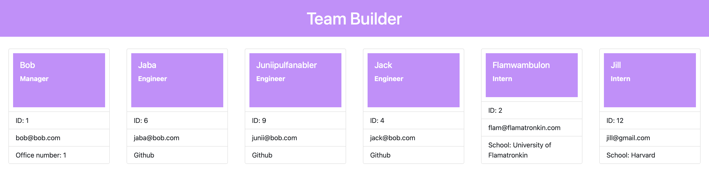

# Team Builder

This is a command line team builder that will allow the user to create a team in their terminal and assign different values to each team member. That information will then dynamically generate on a webpage. 

## Installation
THIS IS NOT A FULLY FUNCTIONAL APPLICATION - merely a work in progress. In order to run this app you will need to install the package-lock.json by using the 'npm i' command in your terminal. Then you will need to run 'node index.js' in order to be prompted with the questions and build your team. You can watch my video of where this application is currently at [here](https://youtu.be/qvLI9FHFKs4).

## Photos 

## Usage

This app is to be used by anyone who finds it interesting or believes they will get some value out of it. 